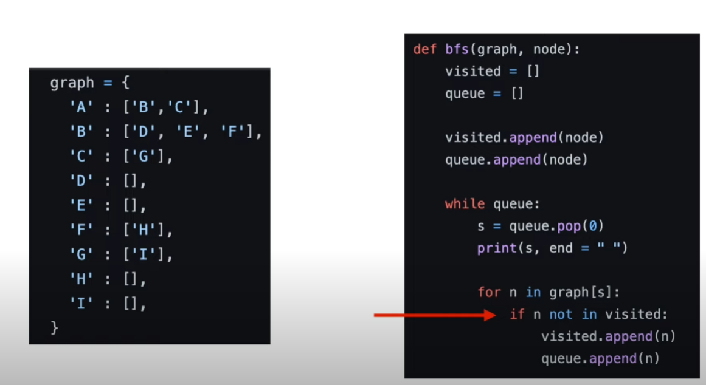

## Обход графа. Поиск в ширину. Алгоритм BFS.

**Обход графа** - это процесс посещения всех вершин графа в определённом порядке. Существует несколько способов обхода графа, один из которых - `поиск в ширину (Breadth-First Search, BFS)`.

**Поиск в ширину** - это алгоритм обхода графа, который посещает все вершины графа, начиная с заданной вершины, и двигается в ширину, то есть посещает все соседние вершины до тех пор, пока не будет достигнута цель или не будет посещена вся графа.

**Алгоритм BFS** работает следующим образом:
1. Создается очередь, в которую добавляется стартовая вершина.
   Пока очередь не пуста, выполняются следующие шаги:
2. Извлекается вершина из очереди.
3. Если вершина не была посещена ранее, она помечается как посещенная.
4. Все соседние вершины, которые не были посещены ранее, добавляются в очередь
5. Алгоритм продолжается до тех пор, пока очередь не будет пуста.

**Сложность O(n+m), где n и m - кол-во вершин и ребер соответственно.**

**Преимущества BFS**
* BFS является эффективным алгоритмом для поиска кратчайшего пути в неориентированном графе.
* BFS может быть использован для поиска связанных компонентов в графе.
* BFS может быть использован для поиска циклов в графе.

**Недостатки BFS**
- BFS может быть медленным для очень больших графов.
- BFS не может быть использован для поиска кратчайшего пути в ориентированном графе.

