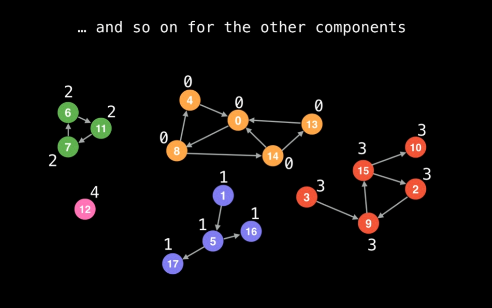

## Поиск компонент связности в графе.

**Поиск компонент связности** в графе заключается в нахождении групп вершин, каждая из которых связана друг с другом напрямую или через промежуточные вершины, но не связана с вершинами из других групп.

**Алгоритм поиска компонент связности** основан на DFS:
1) **Выбор стартовой вершины:** Алгоритм начинает с выбора одной из вершин графа в качестве стартовой.
2) **Пометка вершины как посещенной и добавление в компонент:** Стартовая вершина помечается как посещенная и добавляется в текущую компоненту связности.
3) **Рекурсивный обход смежных вершин:** Для каждой вершины смежной с текущей вершиной , которая еще не была посещена, алгоритм выполняет те же действия: помечает ее как посещенную, добавляет в текущую компоненту, а затем рекурсивно продолжает обход из этой вершины.
4) **Поиск следующей непосещенной вершины:** Алгоритм ищет следующую непосещенную вершину в графе и повторяет процесс обхода с нее, если такая вершина существует. Если не существует, обход заканчивается, и текущая компонента связности считается найденной.
5) **Повторение для оставшихся не посещённых вершин:** Алгоритм повторяет процесс поиска компонент связности для всех оставшихся не посещённых вершин графа.
6) **Возвращение всех компонент связности:** По завершении работы алгоритма возвращается список компонент связности, каждая из которых содержит вершины, входящие в нее.

**Этот процесс позволяет идентифицировать все непересекающиеся группы вершин в графе, которые связаны друг с другом.**

