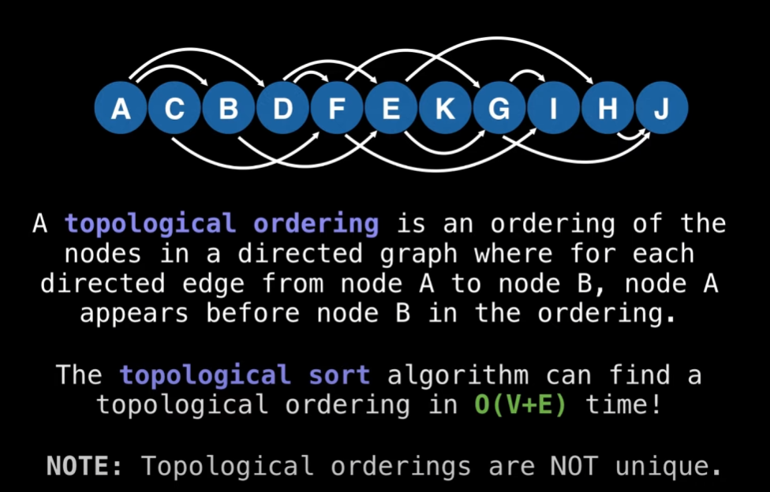
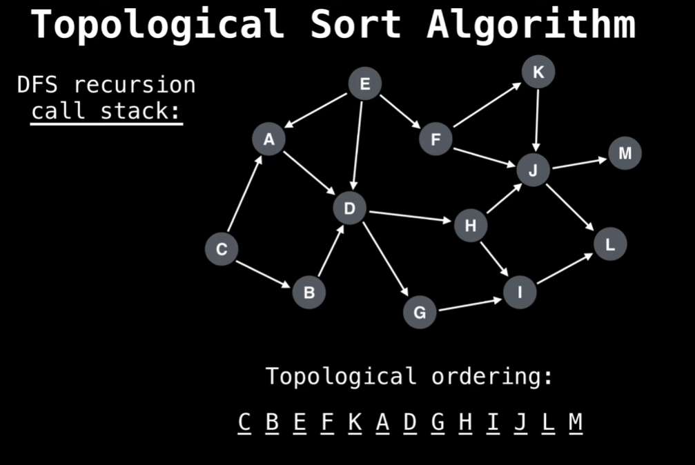

## Топологическая сортировка.

**Топологическая сортировка** - это алгоритмический процесс упорядочения вершин ориентированного ациклического графа (DAG) таким образом, что все направленные ребра идут от вершин с меньшим порядковым номером к вершинам с большим порядковым номером. Другими словами, любое ребро должно идти из меньшей вершины в большую.

**Идея:** чтобы посетить текущую вершину, нужно посетить её соседей, для соседей аналогично, таким образом доходим до крайней вершины без соседа.

**Вот как работает процесс топологической сортировки:**
1. Для каждой вершины графа, если та еще не посещена, вызываем алгоритм сортировки.
2. Помечаем вершину как посещенную, обращаемся ко всем соседям (вершинам в которые идут рёбра от текущей вершины), рекурсивно вызываем алгоритм сортировки для этих вершин.
3. Заносим посещенную вершину в стек.

**Сложность соответствует поиску в глубину:  O(n + m), вершины + ребра.**

Таким способом перебора в стек первыми попадут вершины, у которых нет соседей (нет исходящий ребер), затем 1 исходящее ребро и т.д.

**Вытащив вершины из стека, мы получим их в отсортированном по возрастанию порядке, относительно кол-ва входящих в вершину ребер. Заменив номера вершин на соответствующие им индексы, мы получим топологически отсортированный граф, где ребра будут идти от меньшей вершины к большей.**

