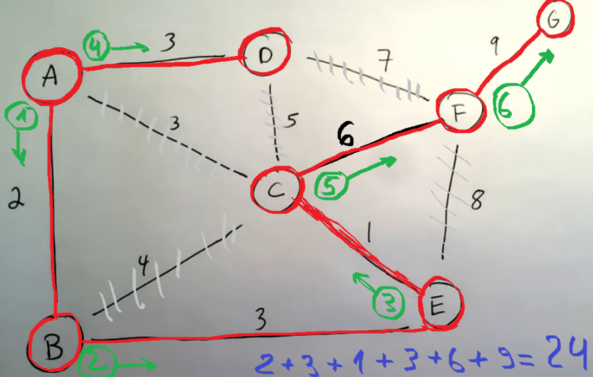

## Алгоритм Прима.

**Алгоритм Прима** — это алгоритм для нахождения минимального остовного дерева (MST) во взвешенном связном графе. Он начинает с одной случайно выбранной вершины и постепенно расширяет остовное дерево, добавляя к нему ребра с наименьшим весом, пока не будет построено дерево, содержащее все вершины исходного графа.

1) **Инициализация:** Выберите любую начальную вершину из графа и поместите ее в MST.
2) **Обновление набора кандидатов ребер:** Из всех ребер, инцидентных `вершинам` в MST, выберите ребро с наименьшим весом, которое присоединяет вершину MST к вершине вне MST. Добавьте это ребро в MST.
3) **Обновление множества кандидатов вершин:** Поместите новую вершину (вершину, соединенную выбранным ребром) в MST.
4) **Повторение шагов 2-3:** Повторяйте шаги 2 и 3 до тех пор, пока MST не содержит все вершины из исходного графа.
5) **Завершение:** Когда MST содержит все вершины из исходного графа, алгоритм завершается.

**Сложность O(n^2), n- кол-во ребер, т.к. мы на каждом шаге перебираем в худшем случае все рёбра и выбираем минимальное.**

> m - вершины, n - ребра
> Эффективный алгоритм, работающий за O(m log n), предлагает хранить все доступные ребра, которые соединяют остовные вершины с ещё не остовными вершинами, в очереди с приоритетом.
> Таким образом при добавлении новой вершины мы добавляем ее ребра в очередь, перезаписываем расстояние (если есть 2 ребра ведущие в 1 вершину, берем минимальное), сортируем, находя минимальное ребро при изменениях за log n.

