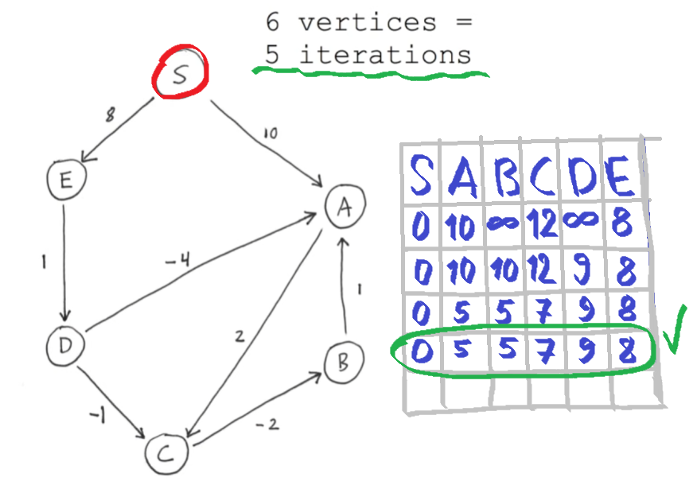

## Алгоритм Беллмана-Форда

**Алгоритм Беллмана-Форда** используется для нахождения кратчайших путей от одной начальной вершины до всех остальных вершин во взвешенном ориентированном графе, даже если в нем присутствуют ребра с отрицательными весами.

1) **Инициализация:** Установите расстояние от начальной вершины до всех остальных вершин равным бесконечности, за исключением начальной вершины, у которой расстояние равно 0.
2) **Релаксация ребер:** Проходите по всем ребрам графа и обновляйте расстояния до каждой вершины, если найден более короткий путь через текущее ребро. Для каждого ребра (u, v) с весом w, обновите расстояние до вершины v как min(distance[v], distance[u] + w).
3) **Повторение:** Повторите шаг 2 n-1 раз, где n - количество вершин в графе. Это необходимо для того, чтобы гарантировать нахождение всех кратчайших путей.
4) **Проверка наличия циклов с отрицательным весом:** После n-1 итераций проверьте все ребра еще раз. Если какое-либо ребро может быть релаксировано, это означает наличие цикла с отрицательным весом в графе.
5) **Завершение:** По завершении работы алгоритма, расстояния от начальной вершины до всех остальных будут содержаться в массиве distance.

**Алгоритм Беллмана-Форда может быть использован для нахождения кратчайших путей в графах с отрицательными ребрами, но его сложность составляет O(V\*E), где V - количество вершин, E - количество ребер.**

